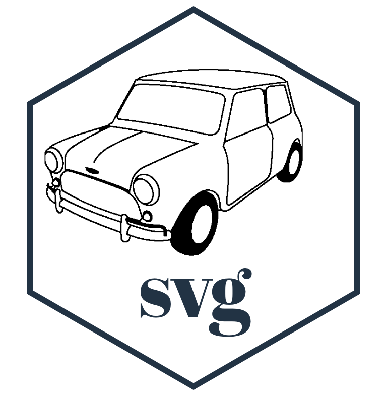
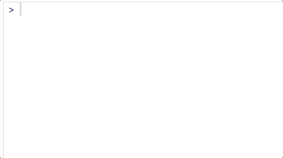
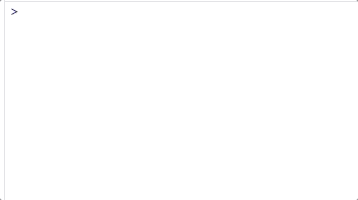
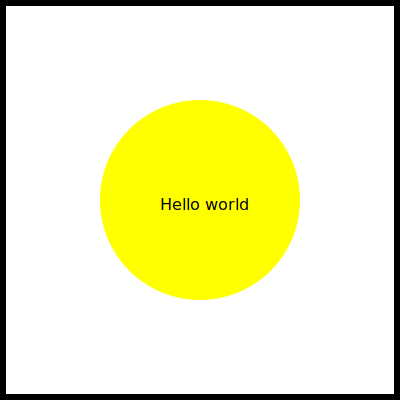
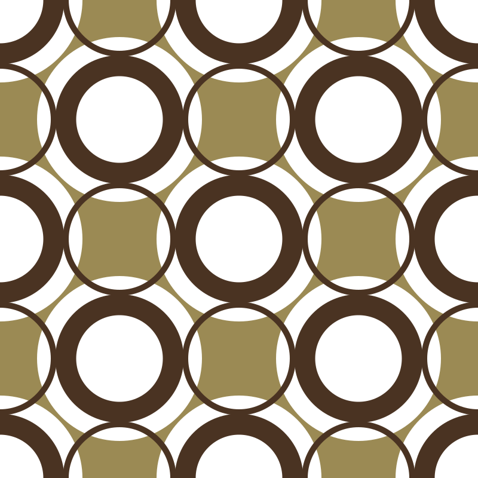

<!-- README.md is generated from README.Rmd. Please edit that file -->

# minisvg 

<!-- badges: start -->


<!-- badges: end -->

`minisvg` is a package for building SVG documents in R.

## Overview

| Need to build | R6 object           | alternate initialisation |
| ------------- | ------------------- | ------------------------ |
| SVG elements  |                     | `stag`                   |
| SVG elements  | `SVGElement$new()`  | `svg_elem()`             |
| SVG document  | `SVGDocument$new()` | `svg_doc()`              |

## Quick Examples

| SVG Entity   | code                                                            | result                                        |
| ------------ | --------------------------------------------------------------- | --------------------------------------------- |
| SVG elements | `stag$circle(cx=0, cy=0, r=20)`                                 | `<circle cx="0" cy="0" r="20" />`             |
| SVG elements | `SVGElement$new('circle', cx=0, cy=0, r=20)`                    | `<circle cx="0" cy="0" r="20" />`             |
| SVG elements | `svg_elem('circle', cx=0, cy=0, r=20)`                          | `<circle cx="0" cy="0" r="20" />`             |
| SVG document | `doc <- SVGDocument$new(); doc$add('circle', cx=0, cy=0, r=20)` | `<svg> <circle cx="0" cy="0" r="20" /></svg>` |
| SVG document | `svg_doc(stag$circle(cx=0, cy=0, r=20))`                        | `<svg> <circle cx="0" cy="0" r="20" /></svg>` |

## Vignettes

  - [Animating SVG with
    SMIL](https://coolbutuseless.github.io/package/minisvg/articles/animation-01-smil.html)
  - [Animating SVG with
    CSS](https://coolbutuseless.github.io/package/minisvg/articles/animation-02-css.html)
  - [Styling SVG with
    CSS](https://coolbutuseless.github.io/package/minisvg/articles/styling-with-css.html)
    both as an inline style chunk and as an external CSS document.
  - [Transformations
    example](https://coolbutuseless.github.io/package/minisvg/articles/transformations.html)
  - [Some pretty (?) animated
    geometry](https://coolbutuseless.github.io/package/minisvg/articles/geometry-example.html)
  - [Creating and Animating the carpet from The Overlook Hotel in The
    Shining](https://coolbutuseless.github.io/package/minisvg/articles/carpet-01.html)
  - [Creating and Animating the a seventies wallpaper
    pattern](https://coolbutuseless.github.io/package/minisvg/articles/wallpaper-01.html)

## Installation

You can install `minisvg` from
[GitHub](https://github.com/coolbutuseless/minisvg) with:

``` r
# install.packages("devtools")
devtools::install_github("coolbutuseless/minisvg")
```

## `stag` helper (autocomplete SVG element creation)

The `stag` helper is similar to `shiny::tag` and `minihtml::htag`



## `svg_prop` helper (autocomplete SVG attribute creation)

The `svg_prop` helper uses autocomplete to help remember the property
attributes of many SVG elements, along with their possible values.



## Interface

  - Individual elements can be created in a number of ways. E.g.
    creating a `defs` block
      - As a stand-alone element
          - `new_elem <- SVGElement$new('defs', style = 'color:
            black;')`
          - `new_elem <- svg_elem('defs', style = 'color: black;')`
          - `new_elem <- stag$defs(style = 'color: black;')`
      - As a sub-element of an existing document or element - the
        element is created, added to the parent document (or element)
        and returned.
          - `doc <- SVGDocument$new(); new_elem <- doc$add('defs', style
            = 'color: black;')`
          - `doc <- SVGDocument$new(); new_elem <- doc$defs(style =
            'color: black;')`
          - `elem <- SVGElement$new('xxx'); new_elem <- elem$add('defs',
            style = 'color: black;')`
          - `elem <- SVGElement$new('xxx'); new_elem <- elem$defs(style
            = 'color: black;')`
  - `$add()` creates an element and adds it to the parent (and returns
    it)
      - `new_elem <- doc$add('defs')`
  - `$append()` appends the given elements as children
      - `new_elem <- stag$defs(); doc$append(new_elem, ...)`
  - `$new(name, ...)`, `$update(...)` and `$add(name, ...)` all accept
    `...` where
      - **named arguments** are added as *attributes* of this node
      - **unnamed argument** are added as *children* of this node

## Hello World SVG Example

This first example demonstrates:

  - initialising a document of a certain size
  - using methods on the `SVGDocument` object to create a circle
  - using the `$append()` method to add the border rectangle
  - creating the border rectangle using the `stag$rect` helper
  - using the `svg_prop` helper (and autocomplete) to assist in
    remembering what the stroke width parameter is called
  - adding text
  - adding a rotation transformation to the
text

<!-- end list -->

``` r
#~~~~~~~~~~~~~~~~~~~~~~~~~~~~~~~~~~~~~~~~~~~~~~~~~~~~~~~~~~~~~~~~~~~~~~~~~~~~~
# Create a document, add a border and a circle
#~~~~~~~~~~~~~~~~~~~~~~~~~~~~~~~~~~~~~~~~~~~~~~~~~~~~~~~~~~~~~~~~~~~~~~~~~~~~~
doc <- SVGDocument$new(width = 400, height = 400)
doc$circle(cx=200, cy=200, r=100, fill = 'yellow')
doc$append(
  stag$rect(
    x = 0, y = 0, width = 400, height = 400, fill = 'none', 
    stroke = 'black', svg_prop$`stroke-width`$set(12)
  )
)

#~~~~~~~~~~~~~~~~~~~~~~~~~~~~~~~~~~~~~~~~~~~~~~~~~~~~~~~~~~~~~~~~~~~~~~~~~~~~~
# Add some text to the document
#~~~~~~~~~~~~~~~~~~~~~~~~~~~~~~~~~~~~~~~~~~~~~~~~~~~~~~~~~~~~~~~~~~~~~~~~~~~~~
mytext <- doc$text("Hello world", x= 160, y = 210, size = 30)

#~~~~~~~~~~~~~~~~~~~~~~~~~~~~~~~~~~~~~~~~~~~~~~~~~~~~~~~~~~~~~~~~~~~~~~~~~~~~~
# Manipulate the text object to add some animation to it
#~~~~~~~~~~~~~~~~~~~~~~~~~~~~~~~~~~~~~~~~~~~~~~~~~~~~~~~~~~~~~~~~~~~~~~~~~~~~~
mytext$animateTransform(
  attributeName = 'transform',
  type          = 'rotate',
  from          = "0 200 200",
  to            = "360 200 200",
  dur           = 5,
  repeatCount   = 'indefinite'
)
```

``` 
   <?xml version="1.0" encoding="UTF-8"?>
   <svg width="400" height="400" viewBox="0 0 400 400" xmlns="http://www.w3.org/2000/svg" xmlns:xlink="http://www.w3.org/1999/xlink">
     <circle fill="yellow" cx="200" cy="200" r="100" />
     <rect fill="none" stroke="black" stroke-width="12" x="0" y="0" width="400" height="400" />
     <text size="30" x="160" y="210">
       Hello world
       <animateTransform attributeName="transform" from="0 200 200" to="360 200 200" type="rotate" dur="5" repeatCount="indefinite" />
     </text>
   </svg>
```



## Parsing SVG text into a `minisvg` document

`minisvg` uses `xml2` to parse SVGL text (or file) into a `minisvg`
document.

``` r
my_svg <- "<svg><circle cx='10' cy='10' r='5'/></svg>"
doc <- minisvg::parse_svg_doc(my_svg)
doc$update(fill = "none")$
  add(name = 'rect')

print(doc)
```

``` 
   <?xml version="1.0" encoding="UTF-8"?>
   <svg width="400" height="400" viewBox="0 0 400 400" xmlns="http://www.w3.org/2000/svg" xmlns:xlink="http://www.w3.org/1999/xlink" fill="none">
     <circle cx="10" cy="10" r="5" />
     <rect />
   </svg>
```

## 70s wallpaper is my jam\!

This is a reproduction of a 70s wallpaper pattern.

This example demonstrates:

  - Using `svg_doc()` as an alternative to `SVGDocument$new()`
  - Creating a `<defs><pattern>` object and applying it to a rectangle

<!-- end list -->

``` r
doc <- svg_doc(width = 800, height = 800) 
doc$rect(x=0, y=0, width="100%", height="100%", fill='#9B8A54')

pat  <- stag$defs()$pattern(id = 'motif', width=400, height=400, patternUnits = 'userSpaceOnUse')
patg <- pat$g()

patg$circle(cx=  0, cy=  0, r=138, fill= 'white')
patg$circle(cx=  0, cy=400, r=138, fill= 'white')
patg$circle(cx=400, cy=  0, r=138, fill= 'white')
patg$circle(cx=400, cy=400, r=138, fill= 'white')
patg$circle(cx=200, cy=200, r=138, fill= 'white')

patg$circle(cx=  0, cy=  0, r=90, fill= 'none', stroke = '#4a3322', stroke_width=35)
patg$circle(cx=  0, cy=400, r=90, fill= 'none', stroke = '#4a3322', stroke_width=35)
patg$circle(cx=400, cy=  0, r=90, fill= 'none', stroke = '#4a3322', stroke_width=35)
patg$circle(cx=400, cy=400, r=90, fill= 'none', stroke = '#4a3322', stroke_width=35)
patg$circle(cx=200, cy=200, r=90, fill= 'none', stroke = '#4a3322', stroke_width=35)

patg$circle(cx=200, cy=  0, r=90, fill= 'none', stroke = '#4a3322', stroke_width=10)
patg$circle(cx=  0, cy=200, r=90, fill= 'none', stroke = '#4a3322', stroke_width=10)
patg$circle(cx=400, cy=200, r=90, fill= 'none', stroke = '#4a3322', stroke_width=10)
patg$circle(cx=200, cy=400, r=90, fill= 'none', stroke = '#4a3322', stroke_width=10)

doc$append(pat)

doc$rect(x=0, y=0, width="100%", height="100%", fill=pat) 
```

``` 
   <?xml version="1.0" encoding="UTF-8"?>
   <svg width="800" height="800" viewBox="0 0 800 800" xmlns="http://www.w3.org/2000/svg" xmlns:xlink="http://www.w3.org/1999/xlink">
     <rect fill="#9B8A54" x="0" y="0" width="100%" height="100%" />
     <pattern id="motif" width="400" height="400" patternUnits="userSpaceOnUse">
       <g>
         <circle fill="white" cx="0" cy="0" r="138" />
         <circle fill="white" cx="0" cy="400" r="138" />
         <circle fill="white" cx="400" cy="0" r="138" />
         <circle fill="white" cx="400" cy="400" r="138" />
         <circle fill="white" cx="200" cy="200" r="138" />
         <circle fill="none" stroke="#4a3322" stroke-width="35" cx="0" cy="0" r="90" />
         <circle fill="none" stroke="#4a3322" stroke-width="35" cx="0" cy="400" r="90" />
         <circle fill="none" stroke="#4a3322" stroke-width="35" cx="400" cy="0" r="90" />
         <circle fill="none" stroke="#4a3322" stroke-width="35" cx="400" cy="400" r="90" />
         <circle fill="none" stroke="#4a3322" stroke-width="35" cx="200" cy="200" r="90" />
         <circle fill="none" stroke="#4a3322" stroke-width="10" cx="200" cy="0" r="90" />
         <circle fill="none" stroke="#4a3322" stroke-width="10" cx="0" cy="200" r="90" />
         <circle fill="none" stroke="#4a3322" stroke-width="10" cx="400" cy="200" r="90" />
         <circle fill="none" stroke="#4a3322" stroke-width="10" cx="200" cy="400" r="90" />
       </g>
     </pattern>
     <rect fill="url('#motif')" x="0" y="0" width="100%" height="100%" />
   </svg>
```



## References

  - The `minisvg` R6 interface is inspired by some of the javascript SVG
    builders
      - [SVG.js](https://svgjs.com)
      - [Snap SVG](http://snapsvg.io/)
  - [Mozilla Developer Network SVG
    docs](https://developer.mozilla.org/en-US/docs/Web/SVG/Element)
