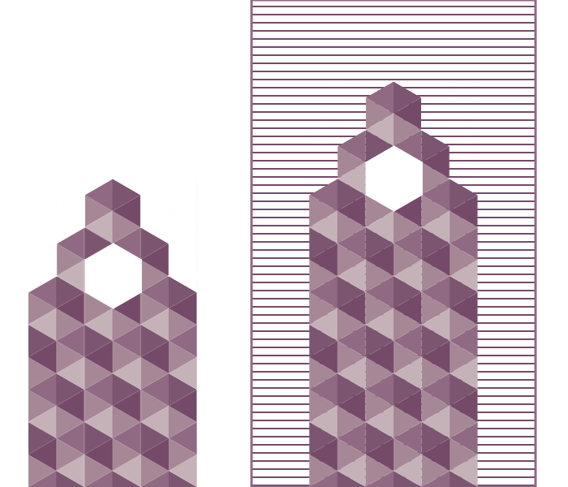
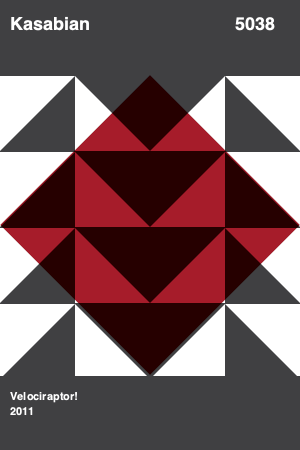

```{r, include = FALSE}
knitr::opts_chunk$set(
  collapse = FALSE,
  comment = "#>"
)
```

## Introduction

These examples are attempting to reproduce some of the patterns used in [Album Anatomy series of posters produced by Duane Dalton](https://duanedalton.com/). Not only are these patterns extremely well designed, they are also useful to illustrate important concepts in use of various `stags` in `minisvg`, as well as application of transformations, filters and masks.

```{r setup}
library(minisvg)
```

## Hurts 4802

This example is reproducing "Hurts 4802" poster from ["Album Anatomy" poster collection](https://www.behance.net/gallery/2770133/Album-Anatomy). 

* The main design element defined in a separate group and included in defs to be reused in mask
and in design itself.
* Transform is happening at the reuse of the graphical element. Use tag does not pull in original element, so it can be independently modified by the transform.


```{r comment=''}
#~~~~~~~~~~~~~~~~~~~~~~~~~~~~~~~~~~~~~~~~~~~~~~~~~~~~~~~~~~~~~~~~~~~~~~~~~~~~~
# Define the document with white background and a main design element as a "loose" group
#~~~~~~~~~~~~~~~~~~~~~~~~~~~~~~~~~~~~~~~~~~~~~~~~~~~~~~~~~~~~~~~~~~~~~~~~~~~~
doc <- svg_doc(width=300, height = 400,
               stag$rect(width = '100%', height = '100%', fill="white",
                         stroke="grey50", stroke_width=1))

stripeg <- stag$g(id="stripe",  
  stag$circle(cx=225, cy=150, r=75),
  stag$rect(x=225-75, y=150, width=151, height  = 400-133 )
)

#~~~~~~~~~~~~~~~~~~~~~~~~~~~~~~~~~~~~~~~~~~~~~~~~~~~~~~~~~~~~~~~~~~~~~~~~~~~~~
# Reuse the same element inside mask, specifying fill and transform
#~~~~~~~~~~~~~~~~~~~~~~~~~~~~~~~~~~~~~~~~~~~~~~~~~~~~~~~~~~~~~~~~~~~~~~~~~~~~
stripeg_mask <- stag$mask(id="stripe_mask", height = 400, width = 150,
                          stag$g(
                            stag$rect(x='0%',y='0%',width = '50%', height = '100%', fill="white"),
                            stag$use(`xlink:href`="#stripe", fill="black", 
                                     svg_prop$transform$rotate(180, 150, 200))
                          )
                      )
#~~~~~~~~~~~~~~~~~~~~~~~~~~~~~~~~~~~~~~~~~~~~~~~~~~~~~~~~~~~~~~~~~~~~~~~~~~~~~
# Put both element and a mask into defs. Use element and the mask
#~~~~~~~~~~~~~~~~~~~~~~~~~~~~~~~~~~~~~~~~~~~~~~~~~~~~~~~~~~~~~~~~~~~~~~~~~~~~
doc$add('defs', stripeg_mask, stripeg)
doc$use(`xlink:href`="#stripe", fill="#999999")
doc$rect(x=0,y=0, width='100%', height = '100%', mask=stripeg_mask, fill="#999999")
#~~~~~~~~~~~~~~~~~~~~~~~~~~~~~~~~~~~~~~~~~~~~~~~~~~~~~~~~~~~~~~~~~~~~~~~~~~~~~
# Add text and define CSS class to be used with it
#~~~~~~~~~~~~~~~~~~~~~~~~~~~~~~~~~~~~~~~~~~~~~~~~~~~~~~~~~~~~~~~~~~~~~~~~~~~~
doc$text(x = 10, y = 30, class = "mainfont1", "Hurts")
doc$text(x = 250, y = 30, class = "mainfont1", "4802")
doc$text(x = 10, y = 360, class = "smallfont1", "Happiness")
doc$text(x = 10, y = 376, class = "smallfont1", "2010")
#~~~~~~~~~~~~~~~~~~~~~~~~~~~~~~~~~~~~~~~~~~~~~~~~~~~~~~~~~~~~~~~~~~~~~~~~~~~~~
# Load CSS for google font and specify styling
#~~~~~~~~~~~~~~~~~~~~~~~~~~~~~~~~~~~~~~~~~~~~~~~~~~~~~~~~~~~~~~~~~~~~~~~~~~~~~
doc$add_css_url("https://fonts.googleapis.com/css?family=Roboto")
doc$add_css("
.mainfont1 {
  font-size: 18px;
  font-weight: 700;
  font-family: 'Roboto', sans-serif;
  fill: #999999;
}
.smallfont1 {
  font-size: 12px;
  font-weight: 700;
  font-family: 'Roboto', sans-serif;
  fill: #ffffff;
}")
```


<!-- Raw HTML output. hidden by default -->
<details closed>
<summary> <span title='Raw HTML'> Raw SVG Text (click to open) </span> </summary>
```{r echo = FALSE, comment=""}
print(doc)
```
</details><br />


```{r echo = FALSE}
doc
```

## The Horrors 5636

This example is reproducing "The Horrors 5636" poster from ["Album Anatomy" poster collection](https://www.behance.net/gallery/2770133/Album-Anatomy). 

* The main design elements are designed and saved away in the `defs` section.
* Filter for mixing colors is defined using `feBlend()`. Note that it may require its
own definition of `filterUnits`.
* The stipes are added in the loop transposing and rescaling at the same time. Multiple transforms can be enumerated in the same `stag`. They will have combined effect, although the order matters. 

```{r comment=''}
#~~~~~~~~~~~~~~~~~~~~~~~~~~~~~~~~~~~~~~~~~~~~~~~~~~~~~~~~~~~~~~~~~~~~~~~~~~~~~
# Define the document. Update viewbox for referencing elements
#~~~~~~~~~~~~~~~~~~~~~~~~~~~~~~~~~~~~~~~~~~~~~~~~~~~~~~~~~~~~~~~~~~~~~~~~~~~~
w<-300

doc <- svg_doc(width=w, height = w*4/3)
doc$update(viewBox = glue::glue("0 0 1 {4/3}"))
doc$rect(width = '100%', height = '100%', fill="white")

#~~~~~~~~~~~~~~~~~~~~~~~~~~~~~~~~~~~~~~~~~~~~~~~~~~~~~~~~~~~~~~~~~~~~~~~~~~~~~
# Define generic line and genertic circle that will be used later
#~~~~~~~~~~~~~~~~~~~~~~~~~~~~~~~~~~~~~~~~~~~~~~~~~~~~~~~~~~~~~~~~~~~~~~~~~~~~
line_stag <- stag$rect(id="lineMe", width=1, height = 0.01, x=0, y=0)

cir <- stag$circle(id="blob",cx=0.5, cy=0.5*4/3, r=0.3*4/3)

#~~~~~~~~~~~~~~~~~~~~~~~~~~~~~~~~~~~~~~~~~~~~~~~~~~~~~~~~~~~~~~~~~~~~~~~~~~~~~
# Define filter for mixing layers. Add all of it ot "defs" section
#~~~~~~~~~~~~~~~~~~~~~~~~~~~~~~~~~~~~~~~~~~~~~~~~~~~~~~~~~~~~~~~~~~~~~~~~~~~~
mutiFilter <- stag$filter(id="multiplyMe", filterUnits = "userSpaceOnUse",
                          stag$feBlend(mode="multiply",
                           in_="SourceGraphic", in2 = "BackgroundImage"))


doc$add('defs', line_stag, cir, mutiFilter)

#~~~~~~~~~~~~~~~~~~~~~~~~~~~~~~~~~~~~~~~~~~~~~~~~~~~~~~~~~~~~~~~~~~~~~~~~~~~~~
# Define a group of reducing thickness lines and add lines by iterating
#~~~~~~~~~~~~~~~~~~~~~~~~~~~~~~~~~~~~~~~~~~~~~~~~~~~~~~~~~~~~~~~~~~~~~~~~~~~~
linesg <- doc$g() 

for(i in seq_len(8)){
  linesg$use(`xlink:href`="#lineMe", fill="#00b086", 
             svg_prop$transform$translate(0, 0.95/10*(i-1)+0.03),
             svg_prop$transform$scale(1, (8-i)*0.7+3))
}

#~~~~~~~~~~~~~~~~~~~~~~~~~~~~~~~~~~~~~~~~~~~~~~~~~~~~~~~~~~~~~~~~~~~~~~~~~~~~~
# Add header and footer lines
#~~~~~~~~~~~~~~~~~~~~~~~~~~~~~~~~~~~~~~~~~~~~~~~~~~~~~~~~~~~~~~~~~~~~~~~~~~~~
linesg$append(
  stag$use(`xlink:href`="#lineMe", fill="#00b086", 
           svg_prop$transform$translate(0, 0),
           svg_prop$transform$scale(1, 3*4/3)),
  stag$use(`xlink:href`="#lineMe", fill="#55bcec", 
           svg_prop$transform$translate(0, 0.6*4/3),
           svg_prop$transform$scale(1, 20*4/3)),
  stag$use(`xlink:href`="#lineMe", fill="#005288", 
           svg_prop$transform$translate(0, 0.8*4/3),
           svg_prop$transform$scale(1, 20*4/3)
           )
)

#~~~~~~~~~~~~~~~~~~~~~~~~~~~~~~~~~~~~~~~~~~~~~~~~~~~~~~~~~~~~~~~~~~~~~~~~~~~~~
# Reuse circles pulling them apart
#~~~~~~~~~~~~~~~~~~~~~~~~~~~~~~~~~~~~~~~~~~~~~~~~~~~~~~~~~~~~~~~~~~~~~~~~~~~~
doc$use(`xlink:href`="#blob", fill="#da0023",
        svg_prop$transform$translate(-0.5,0),
        filter="url(#multiplyMe)"
        )
doc$use(`xlink:href`="#blob", fill="#da0023", 
        svg_prop$transform$translate(+0.5,0),
        filter="url(#multiplyMe)")
```


<!-- Raw HTML output. hidden by default -->
<details closed>
<summary> <span title='Raw HTML'> Raw SVG Text (click to open) </span> </summary>
```{r echo = FALSE, comment=""}
print(doc)
```
</details><br />


```{r echo = FALSE}
doc$save("svg/thehorrors5636.svg")
rsvg::rsvg_png("svg/thehorrors5636.svg", "images/thehorrors5636.png")
magick::image_read("images/thehorrors5636.png") 
```


## Bon Iver 3925

This example is reproducing "Bon Iver 3925" poster from ["Album Anatomy" poster collection](https://bldgwlf.com/album-anatomy-2/)

* The main shape (triangle) is defined only once. It is later reused (scaled and shifted), both original and the transformed triangles are grouped and reused again (with a different fill) to complete a pattern. This is done with `use` and `xlink:href`.
* Even though it would be possible to just overlay a circle colored in background color,
in this example, `mask` is used to demonstrate compositing objects. Black objects will become holes and white objects will become opaque areas.
* Even though it would be possible to achieve somewhat similar results by manipulating
transparency of the objects, this example demonstrates the use of `feBlend` to combine
opaque objects. Multiplication of brown triangle with the pattern produces color combination
very close to original artwork by Duane Dalton.

```{r comment=''}
#~~~~~~~~~~~~~~~~~~~~~~~~~~~~~~~~~~~~~~~~~~~~~~~~~~~~~~~~~~~~~~~~~~~~~~~~~~~~~
# Define the size of canvas and main design element: the triangle
#~~~~~~~~~~~~~~~~~~~~~~~~~~~~~~~~~~~~~~~~~~~~~~~~~~~~~~~~~~~~~~~~~~~~~~~~~~~~~
w <- 540; h <- 480
big_trg <- stag$polygon(id="big_3angl", xs = c(0,0,w/9,0), ys = c(0,h/4,h/4,0))

#~~~~~~~~~~~~~~~~~~~~~~~~~~~~~~~~~~~~~~~~~~~~~~~~~~~~~~~~~~~~~~~~~~~~~~~~~~~~~
# Define BW mask that will be used to punch a hole in a big triangle
#~~~~~~~~~~~~~~~~~~~~~~~~~~~~~~~~~~~~~~~~~~~~~~~~~~~~~~~~~~~~~~~~~~~~~~~~~~~~~
holeMask <- stag$mask(id="myMask",
                  stag$rect(x=0,y=0, width="100%", height = "100%", fill="white"),
                  stag$circle(cx=w/9/3, cy=w/4-w/15, r=9, fill='black'))
#~~~~~~~~~~~~~~~~~~~~~~~~~~~~~~~~~~~~~~~~~~~~~~~~~~~~~~~~~~~~~~~~~~~~~~~~~~~~~
# Define pattern group: big triangle (punched) and small triangle (shifted and scaled)
#~~~~~~~~~~~~~~~~~~~~~~~~~~~~~~~~~~~~~~~~~~~~~~~~~~~~~~~~~~~~~~~~~~~~~~~~~~~~~
trgs <- stag$g(id='triangles', stroke = 'none',
               stag$use(`xlink:href` = "#big_3angl", mask="url(#myMask)"),
               stag$use(`xlink:href` = "#big_3angl", 
                        svg_prop$transform$translate(w/9/2),
                        svg_prop$transform$scale(0.5, 0.5)))
#~~~~~~~~~~~~~~~~~~~~~~~~~~~~~~~~~~~~~~~~~~~~~~~~~~~~~~~~~~~~~~~~~~~~~~~~~~~~~
# Define pattern: it uses pattern group twice (original and shifted) with different fill
#~~~~~~~~~~~~~~~~~~~~~~~~~~~~~~~~~~~~~~~~~~~~~~~~~~~~~~~~~~~~~~~~~~~~~~~~~~~~~
pat <- stag$pattern(width=w/9*2, height=h/4, id = 'motif', patternUnits = 'userSpaceOnUse')

pat$use(`xlink:href` = "#triangles", fill="#007360")
pat$use(`xlink:href` = "#triangles", fill="#a1d1b9", svg_prop$transform$translate(w/9))
#~~~~~~~~~~~~~~~~~~~~~~~~~~~~~~~~~~~~~~~~~~~~~~~~~~~~~~~~~~~~~~~~~~~~~~~~~~~~~
# Define filter for overlaying pattern over brown triangle in "multiply" mode
#~~~~~~~~~~~~~~~~~~~~~~~~~~~~~~~~~~~~~~~~~~~~~~~~~~~~~~~~~~~~~~~~~~~~~~~~~~~~~
mutiFilter <- stag$filter(id="multiplyMe", stag$feBlend(mode="multiply",
                          in_="SourceGraphic", in2 = "BackgroundImage"))
#~~~~~~~~~~~~~~~~~~~~~~~~~~~~~~~~~~~~~~~~~~~~~~~~~~~~~~~~~~~~~~~~~~~~~~~~~~~~~
# Define document with white-ish background and add all above objects to "defs"
#~~~~~~~~~~~~~~~~~~~~~~~~~~~~~~~~~~~~~~~~~~~~~~~~~~~~~~~~~~~~~~~~~~~~~~~~~~~~~
doc <- svg_doc(width = w, height = h,
               stag$rect(x=0, y=0, width='100%', height='100%', fill='#faf6f2'))

doc$add('defs', holeMask, big_trg, trgs, pat, mutiFilter)
#~~~~~~~~~~~~~~~~~~~~~~~~~~~~~~~~~~~~~~~~~~~~~~~~~~~~~~~~~~~~~~~~~~~~~~~~~~~~~
# Define brown triangle and overlay it with a pattern multiplying these layers
#~~~~~~~~~~~~~~~~~~~~~~~~~~~~~~~~~~~~~~~~~~~~~~~~~~~~~~~~~~~~~~~~~~~~~~~~~~~~~
doc$add('polygon', xs=c(0, w/9*2,0,0), ys=c(0, h/2, h, 0), fill="#c55b48", fill_opacity=1)
doc$add('rect', x=0, y=0, width='100%', height='100%', fill=pat, filter="url(#multiplyMe)")
```


<!-- Raw HTML output. hidden by default -->
<details closed>
<summary> <span title='Raw HTML'> Raw SVG Text (click to open) </span> </summary>
```{r echo = FALSE, comment=""}
print(doc)
```
</details><br />


```{r echo = FALSE}
doc$save("svg/boniver3925.svg")
rsvg::rsvg_png("svg/boniver3925.svg", "images/boniver3925.png")
knitr::include_graphics("images/boniver3925.png")
```

Please, note that `feBlend` may not be properly rendered by [your browser](https://stackoverflow.com/questions/4797803/svg-feblend-in-pattern) (that is the case when all pattern triangles look the same dark color). Try convering `svg` image to `png` using `rsvg::rsvg_png()` or rendering it in Chrome.

## Palma Violets 4218

This example is reproducing "Palma Violets 4218" poster from ["Album Anatomy" poster collection](https://www.behance.net/gallery/2770133/Album-Anatomy)

* This pattern consists of a quarter circle segment, which can be achieved by drawing full circle and clipping it to size
* Row 3 contains "inverted pattern". This can be achieved by reusing the pattern as a mask and
"cutting" plain square with it. Note that we store away custom made cell ("negCrescent")
* Identifying the repeating pattern in the rows, we then compose a pattern in the first column
and apply it across

```{r comment=''}
#~~~~~~~~~~~~~~~~~~~~~~~~~~~~~~~~~~~~~~~~~~~~~~~~~~~~~~~~~~~~~~~~~~~~~~~~~~~~~
# Define the size of cell and clip path of this size to contain each cell element
#~~~~~~~~~~~~~~~~~~~~~~~~~~~~~~~~~~~~~~~~~~~~~~~~~~~~~~~~~~~~~~~~~~~~~~~~~~~~~
s <- 100;
clipsq <- stag$clipPath(id="clipSquare",
                        stag$rect(x=0, y=0, width = s, height = s))
#~~~~~~~~~~~~~~~~~~~~~~~~~~~~~~~~~~~~~~~~~~~~~~~~~~~~~~~~~~~~~~~~~~~~~~~~~~~~~
# Define the main geometry: a circle clipped to cell size by `clip-path`
#~~~~~~~~~~~~~~~~~~~~~~~~~~~~~~~~~~~~~~~~~~~~~~~~~~~~~~~~~~~~~~~~~~~~~~~~~~~~~
gcir <- stag$circle(id="crescent", cx=s, cy=s, r=s, fill="#faf6f2", `clip-path`="url(#clipSquare)")
#~~~~~~~~~~~~~~~~~~~~~~~~~~~~~~~~~~~~~~~~~~~~~~~~~~~~~~~~~~~~~~~~~~~~~~~~~~~~~
# define a mask for "inverted" cell in row 3. Deep copy circle and update its fill
#~~~~~~~~~~~~~~~~~~~~~~~~~~~~~~~~~~~~~~~~~~~~~~~~~~~~~~~~~~~~~~~~~~~~~~~~~~~~~
gmsk <- stag$mask(id="crescentMask",
                  stag$rect(x=0, y=0, width = '100%', height ='100%', fill="white"),
                  gcir$copy()$update(fill="black"))#, svg_prop$transform$rotate(180, s/2,s/2)))

ig <- stag$rect(id="negCrescent", x=0, y=0, width='100%', height='100%', fill="#faf6f2", 
                mask="url(#crescentMask)", `clip-path`="url(#clipSquare)")
#~~~~~~~~~~~~~~~~~~~~~~~~~~~~~~~~~~~~~~~~~~~~~~~~~~~~~~~~~~~~~~~~~~~~~~~~~~~~~
# Compose a pattern as a single column. Translate and rotate main cell as needed
#~~~~~~~~~~~~~~~~~~~~~~~~~~~~~~~~~~~~~~~~~~~~~~~~~~~~~~~~~~~~~~~~~~~~~~~~~~~~~
pat <- stag$pattern(width=s, height=s*5, id = 'motif', patternUnits = 'userSpaceOnUse')
pat$use(`xlink:href`="#crescent")
pat$use(`xlink:href`="#crescent", 
        svg_prop$transform$translate(0, s*1),
        svg_prop$transform$rotate(90, s/2, s/2))
pat$use(`xlink:href`="#negCrescent",
        svg_prop$transform$translate(0, s*2),
        svg_prop$transform$rotate(180, s/2, s/2))
pat$use(`xlink:href`="#crescent", 
        svg_prop$transform$translate(0, s*3),
        svg_prop$transform$rotate(90, s/2, s/2))
pat$use(`xlink:href`="#crescent", 
        svg_prop$transform$translate(0, s*4),
        svg_prop$transform$rotate(-90, s/2, s/2))
#~~~~~~~~~~~~~~~~~~~~~~~~~~~~~~~~~~~~~~~~~~~~~~~~~~~~~~~~~~~~~~~~~~~~~~~~~~~~~
# Define the document, add all above elements to `defs` and roll out the pattern
#~~~~~~~~~~~~~~~~~~~~~~~~~~~~~~~~~~~~~~~~~~~~~~~~~~~~~~~~~~~~~~~~~~~~~~~~~~~~~
doc <- svg_doc(width = s*5, height = s*5, 
               stag$rect(x=0, y=0, width='100%', height='100%', fill="grey20"))
doc$add('defs', clipsq, gcir, ig, gmsk, pat)
doc$add('rect', x=0, y=0, width='100%', height='100%', fill=pat)

```

<!-- Raw HTML output. hidden by default -->
<details closed>
<summary> <span title='Raw HTML'> Raw SVG Text (click to open) </span> </summary>
```{r echo = FALSE, comment=""}
print(doc)
```
</details><br />


```{r echo = FALSE}
doc
#doc$save("svg/palmaviolets4218.svg")
#rsvg::rsvg_png("svg/palmaviolets4218.svg", "images/palmaviolets4218.svg")
#knitr::include_graphics("images/palmaviolets4218.svg")
```

## Crystal Castles 5155


This example is reproducing "Crystal Castles 5155" poster from ["Album Anatomy" poster collection](https://www.behance.net/gallery/2770133/Album-Anatomy)

* This pattern consists of a hex (6 triangles), two half-hexes below it and small wedges
above the main hex to cover the fact that pattern can only be rectangular.
* Same constructed hex elements are then reused to create a mask - top few hexes are "hidden"
under it to create the narrow tower head. Also note that mask elements are created in the list
and dumped into the group to be transposed where they need to go. It is a good idea to leave 
transformations to the group and not define them on the children. Then same children can be 
reused in several places, wrapped into custom groups.
* Same hexagon is then reused third time to create a window.
* There's a trick how to create a pattern which starts from the corner of the object, not from point 0,0 of the screen. Read more about coordinate system and transformations [here](http://tavmjong.free.fr/SVG/publish/coords.html).

```{r comment=''}
#~~~~~~~~~~~~~~~~~~~~~~~~~~~~~~~~~~~~~~~~~~~~~~~~~~~~~~~~~~~~~~~~~~~~~~~~~~~~~
# Define service functions for updating children lists and calculate hex vertices
#~~~~~~~~~~~~~~~~~~~~~~~~~~~~~~~~~~~~~~~~~~~~~~~~~~~~~~~~~~~~~~~~~~~~~~~~~~~~~
update_children <- function(obj, ...){
  obj$update_child_list(
    lapply(obj$children, function(x) x$update(...)))
}

len     <- 40
shift0 <- function(x) x - min(x)
get_hex_coords <- function(len, f, angles) shift0(round(len * f(angles) + len, 2))

angles <- (seq(0, 360, 60) + 90) * pi/180
xs    <- get_hex_coords(len, cos, angles)
ys    <- get_hex_coords(len, sin, angles)

#~~~~~~~~~~~~~~~~~~~~~~~~~~~~~~~~~~~~~~~~~~~~~~~~~~~~~~~~~~~~~~~~~~~~~~~~~~~~~
# Define color to be used in the pattern. Cache dimensions of hex and centroids
#~~~~~~~~~~~~~~~~~~~~~~~~~~~~~~~~~~~~~~~~~~~~~~~~~~~~~~~~~~~~~~~~~~~~~~~~~~~~~
colrs <- c( "#906a83", "#a68796","#754a68", "#a68796","#c5b2b8", "#7c5570")

min_xs <- min(xs); max_xs <- max(xs)
min_ys <- min(ys); max_ys <-max(ys)
xsC <- c(min_xs, mean(range(xs)), max_xs)
ysC <- c(max_ys+len/2, mean(range(ys)), max_ys+len/2)

#~~~~~~~~~~~~~~~~~~~~~~~~~~~~~~~~~~~~~~~~~~~~~~~~~~~~~~~~~~~~~~~~~~~~~~~~~~~~~
# Define pattern. Note pattern units - pattern starts from 0 and spreads indefinitely.
#~~~~~~~~~~~~~~~~~~~~~~~~~~~~~~~~~~~~~~~~~~~~~~~~~~~~~~~~~~~~~~~~~~~~~~~~~~~~~
pat  <- stag$pattern(width=max_xs, height=max_ys+len, #this means 3x4.5 patterns
                     id = 'motif', 
                     patternContentUnits = "userSpaceOnUse",
                     patternUnits="userSpaceOnUse")

#~~~~~~~~~~~~~~~~~~~~~~~~~~~~~~~~~~~~~~~~~~~~~~~~~~~~~~~~~~~~~~~~~~~~~~~~~~~~~
# This loop creates a hex. Adds to the group created for storing whole hex
#~~~~~~~~~~~~~~~~~~~~~~~~~~~~~~~~~~~~~~~~~~~~~~~~~~~~~~~~~~~~~~~~~~~~~~~~~~~~~
g_hex <-  stag$g(id="hex")
for (i in head(seq_along(xs), -1)){
  g_hex$polygon(xs=c(xsC[2], xs[i], xs[i+1], xsC[2]),
            ys=c(ysC[2], ys[i], ys[i+1], ysC[2]), fill=colrs[i], 
            stroke="none")
}

#~~~~~~~~~~~~~~~~~~~~~~~~~~~~~~~~~~~~~~~~~~~~~~~~~~~~~~~~~~~~~~~~~~~~~~~~~~~~~
# Define half-hex for right- and left side and small upper segments. Add all to pattern
#~~~~~~~~~~~~~~~~~~~~~~~~~~~~~~~~~~~~~~~~~~~~~~~~~~~~~~~~~~~~~~~~~~~~~~~~~~~~~
g_ohex_right <- stag$g(id="ohex_right")
g_ohex_uright <- stag$g(id="ohex_uright")
# lower and upper right pennants (segment 1 split)
g_ohex_right$polygon(xs=c(max_xs,xsC[2],max_xs, max_xs),
               ys=c(max_ys+len, max_ys+len, ysC[3], max_ys+len), fill=colrs[1])
g_ohex_uright$polygon(xs=c(max_xs,xsC[2],max_xs, max_xs),
               ys=c(min_ys+len/2, min_ys, min_ys, min_ys+len/2), fill=colrs[1])
# segments 2 and 3 on the right
g_ohex_right$polygon(xs=c(max_xs,xsC[2],xsC[2], max_xs),
               ys=c(ysC[3], max_ys+len, max_ys, ysC[3]), fill=colrs[2])
g_ohex_right$polygon(xs=c(max_xs,xsC[2],max_xs, max_xs),
               ys=c(ysC[3], max_ys, max_ys-len/2, ysC[3]), fill=colrs[3])

g_ohex_left <- stag$g(id="ohex_left")
g_ohex_uleft <- stag$g(id="ohex_uleft")
## lower and upper left pennants (segment 6 split)
g_ohex_left$polygon(xs=c(min_xs,xsC[2],min_xs, min_xs),
               ys=c(max_ys+len, max_ys+len, ysC[1], max_ys+len), fill=colrs[6])
g_ohex_uleft$polygon(xs=c(min_xs,xsC[2],min_xs, min_xs),
               ys=c(min_ys+len/2, min_ys, min_ys, min_ys+len/2), fill=colrs[6])
# segments 5 and 4 on the right
g_ohex_left$polygon(xs=c(min_xs,xsC[2],xsC[2], min_xs),
               ys=c(ysC[1], max_ys+len, max_ys, ysC[1]), fill=colrs[5])
g_ohex_left$polygon(xs=c(min_xs,xsC[2],min_xs, min_xs),
               ys=c(ysC[1], max_ys, max_ys-len/2, ysC[1]), fill=colrs[4])

pat$append(g_hex, g_ohex_right, g_ohex_uright, g_ohex_left, g_ohex_uleft)

#~~~~~~~~~~~~~~~~~~~~~~~~~~~~~~~~~~~~~~~~~~~~~~~~~~~~~~~~~~~~~~~~~~~~~~~~~~~~~
# Copy hexes. These will become masks.
#~~~~~~~~~~~~~~~~~~~~~~~~~~~~~~~~~~~~~~~~~~~~~~~~~~~~~~~~~~~~~~~~~~~~~~~~~~~~~
g1_hex <- update_children(g_hex$copy(), fill="black", stroke="black")$update(id="hex1")
g1_ohex_right <- update_children(g_ohex_right$copy(),  fill="black", stroke="black")$update(id="ohex1_right")
g1_ohex_uright <- update_children(g_ohex_uright$copy(),  fill="black", stroke="black")$update(id="ohex1_uright")
g1_ohex_left <- update_children(g_ohex_left$copy(),  fill="black", stroke="black")$update(id="ohex1_left")
g1_ohex_uleft <- update_children(g_ohex_uleft$copy(),  fill="black", stroke="black")$update(id="ohex1_uleft")

#~~~~~~~~~~~~~~~~~~~~~~~~~~~~~~~~~~~~~~~~~~~~~~~~~~~~~~~~~~~~~~~~~~~~~~~~~~~~~
# Define a list that will store mask elements for covering the tops of "towers".
#~~~~~~~~~~~~~~~~~~~~~~~~~~~~~~~~~~~~~~~~~~~~~~~~~~~~~~~~~~~~~~~~~~~~~~~~~~~~~
mask_lst <- list(
  stag$rect(x='0%', y='0%', width = '100%', height = '100%', fill="white"),
  stag$g(svg_prop$transform$translate(0, 0),
         stag$use(`xlink:href`="#hex1"),
         stag$use(`xlink:href`="#ohex1_uleft"),
         stag$use(`xlink:href`="#ohex1_left"),
         stag$use(`xlink:href`="#ohex1_uright")
  ),
  stag$g(svg_prop$transform$translate(max_xs, 0),
         stag$use(`xlink:href`="#ohex1_uleft"),
         stag$use(`xlink:href`="#ohex1_uright")
  ),
  stag$g(svg_prop$transform$translate(2*max_xs, 0),
         stag$use(`xlink:href`="#hex1"),
         stag$use(`xlink:href`="#ohex1_uleft"),
         stag$use(`xlink:href`="#ohex1_right"),
         stag$use(`xlink:href`="#ohex1_uright")
  ),
  stag$g(svg_prop$transform$translate(0, max_ys+len), 
         stag$use(`xlink:href`="#ohex1_uleft")
  ),
  stag$g(svg_prop$transform$translate(0+2*max_xs, 0+max_ys+len), 
         stag$use(`xlink:href`="#ohex1_uright")
  ))

#~~~~~~~~~~~~~~~~~~~~~~~~~~~~~~~~~~~~~~~~~~~~~~~~~~~~~~~~~~~~~~~~~~~~~~~~~~~~~
# Define a first mask. Note that mask is wrapped into translated group.
#~~~~~~~~~~~~~~~~~~~~~~~~~~~~~~~~~~~~~~~~~~~~~~~~~~~~~~~~~~~~~~~~~~~~~~~~~~~~~
header_mask1_g <- stag$g(svg_prop$transform$translate(35,220))
invisible(sapply(mask_lst, function(x) header_mask1_g$append(x)))

header_mask1 <- stag$mask(id='header_mask1', x='0%', y='0%', width='100%', height='100%', 
                             maskUnits="objectBoundingBox", 
                             maskContentUnits = "userSpaceOnUse",
                             header_mask1_g)
#~~~~~~~~~~~~~~~~~~~~~~~~~~~~~~~~~~~~~~~~~~~~~~~~~~~~~~~~~~~~~~~~~~~~~~~~~~~~~
# Define a second mask. Note that mask is wrapped into translated group.
#~~~~~~~~~~~~~~~~~~~~~~~~~~~~~~~~~~~~~~~~~~~~~~~~~~~~~~~~~~~~~~~~~~~~~~~~~~~~~
header_mask2_g <- stag$g(svg_prop$transform$translate(381,100))
invisible(sapply(mask_lst, function(x) header_mask2_g$append(x)))

header_mask2 <- stag$mask(id='header_mask2', x='0%', y='0%', width='100%', height='100%', #this means 3x4.5 patterns
                          maskUnits="objectBoundingBox", #objectBoundingBox
                          maskContentUnits = "userSpaceOnUse",
                          header_mask2_g)
#~~~~~~~~~~~~~~~~~~~~~~~~~~~~~~~~~~~~~~~~~~~~~~~~~~~~~~~~~~~~~~~~~~~~~~~~~~~~~
# Define a pattern for striped background behind 2 tower
#~~~~~~~~~~~~~~~~~~~~~~~~~~~~~~~~~~~~~~~~~~~~~~~~~~~~~~~~~~~~~~~~~~~~~~~~~~~~~
pat_lines  <- stag$pattern(width=300, height=10, #this means 3x4.5 patterns
                           id = 'motif_lines', 
                           patternContentUnits = "userSpaceOnUse",
                           patternUnits="userSpaceOnUse",
                           stag$g(
                           stag$line(x1 = 0, x2=300, y1=8, y2=8), 
                                stroke="#754a68", stroke_width=2))

#~~~~~~~~~~~~~~~~~~~~~~~~~~~~~~~~~~~~~~~~~~~~~~~~~~~~~~~~~~~~~~~~~~~~~~~~~~~~~
# Copy the hex to be used as "white window" on towers.
#~~~~~~~~~~~~~~~~~~~~~~~~~~~~~~~~~~~~~~~~~~~~~~~~~~~~~~~~~~~~~~~~~~~~~~~~~~~~~
g2_hex <- update_children(g_hex$copy(), fill="white", stroke="white")$update(id="hex2")


#~~~~~~~~~~~~~~~~~~~~~~~~~~~~~~~~~~~~~~~~~~~~~~~~~~~~~~~~~~~~~~~~~~~~~~~~~~~~~
# Define document, add all service elements to 'defs'
#~~~~~~~~~~~~~~~~~~~~~~~~~~~~~~~~~~~~~~~~~~~~~~~~~~~~~~~~~~~~~~~~~~~~~~~~~~~~~
doc <- svg_doc(width=700, height=600,
               stag$rect(x=0, y=0, width='100%', height = '100%', fill="white"))
doc$add('defs',pat, pat_lines, header_mask1, header_mask2, g1_hex, g1_ohex_right, 
        g1_ohex_uright, g1_ohex_left, g1_ohex_uleft, g2_hex)

#~~~~~~~~~~~~~~~~~~~~~~~~~~~~~~~~~~~~~~~~~~~~~~~~~~~~~~~~~~~~~~~~~~~~~~~~~~~~~
# 2 rectangles filled with patterns and masks - towers, one rectangle for stripes.
#~~~~~~~~~~~~~~~~~~~~~~~~~~~~~~~~~~~~~~~~~~~~~~~~~~~~~~~~~~~~~~~~~~~~~~~~~~~~~
doc$add('rect', x=35, y=220, width=max_xs*3, height=4.5*(max_ys+len), 
        fill=pat, mask="url(#header_mask1)")
doc$add('rect', x=310, y=0, width=350, height="100%", fill=pat_lines, stroke=colrs[1], stroke_width=3)
doc$add('rect', x=381, y=100, width=max_xs*3, height=4.5*(max_ys+len), 
        fill=pat, mask="url(#header_mask2)")
#~~~~~~~~~~~~~~~~~~~~~~~~~~~~~~~~~~~~~~~~~~~~~~~~~~~~~~~~~~~~~~~~~~~~~~~~~~~~~
# Place windows where they need to be
#~~~~~~~~~~~~~~~~~~~~~~~~~~~~~~~~~~~~~~~~~~~~~~~~~~~~~~~~~~~~~~~~~~~~~~~~~~~~~
doc$use(`xlink:href`="#hex2", svg_prop$transform$translate(x=105, 300))
doc$use(`xlink:href`="#hex2", svg_prop$transform$translate(x=451, 180))

```

<!-- Raw HTML output. hidden by default -->
<details closed>
<summary> <span title='Raw HTML'> Raw SVG Text (click to open) </span> </summary>
```{r echo = FALSE, comment=""}
print(doc)
```
</details><br />


```{r echo = FALSE}
#doc
doc$save("svg/crystalcastles5155.svg")
rsvg::rsvg_png("svg/crystalcastles5155.svg", "images/crystalcastles5155.png")

```

Please, note that if some of the elements do not get properly rendered by your browser, try convering `svg` images to `png` using `rsvg::rsvg_png()` or rendering them in Chrome.

## Beach House 4910

This example is reproducing "Beach House 4910" poster from ["Album Anatomy" poster collection](https://www.behance.net/gallery/2770133/Album-Anatomy). 

* The main design element is a single stripe with an empty space to the left of it.
* Layer sequence defines visible effect. First vertical pattern is drawn. Then circles are overlayed on top (partially obifuscated by the mask). Finally horizontal stripes and lines running across are added.


```{r comment=''}
#~~~~~~~~~~~~~~~~~~~~~~~~~~~~~~~~~~~~~~~~~~~~~~~~~~~~~~~~~~~~~~~~~~~~~~~~~~~~~
# Define the document with sand background
#~~~~~~~~~~~~~~~~~~~~~~~~~~~~~~~~~~~~~~~~~~~~~~~~~~~~~~~~~~~~~~~~~~~~~~~~~~~~
f <- "#dcceac"

doc <- svg_doc(width=300, height=380)
doc$rect(x=0, y=0, width='100%', height = '100%', fill=f)

#~~~~~~~~~~~~~~~~~~~~~~~~~~~~~~~~~~~~~~~~~~~~~~~~~~~~~~~~~~~~~~~~~~~~~~~~~~~~~
# Define pattern with single line. Note the line extends beyond visible area for rotation
#~~~~~~~~~~~~~~~~~~~~~~~~~~~~~~~~~~~~~~~~~~~~~~~~~~~~~~~~~~~~~~~~~~~~~~~~~~~~
lines_g <- stag$rect( x=300/20, y=-100, width = 300/20, height = 550, fill="white")
pats  <- stag$pattern(width=300/10, height=500, 
                     id = 'stripes_beach', 
                     patternContentUnits = "userSpaceOnUse",
                     patternUnits="userSpaceOnUse",
                     lines_g)
#~~~~~~~~~~~~~~~~~~~~~~~~~~~~~~~~~~~~~~~~~~~~~~~~~~~~~~~~~~~~~~~~~~~~~~~~~~~~~
# Define masking rectangle. It will cover lover part of circle. Add all building elements to defs
#~~~~~~~~~~~~~~~~~~~~~~~~~~~~~~~~~~~~~~~~~~~~~~~~~~~~~~~~~~~~~~~~~~~~~~~~~~~~
msk <- stag$mask(id="r_msk",x='0%', y='0%', width='100%', height='100%', 
                            maskUnits="userSpaceOnUse",
                            maskContentUnits = "userSpaceOnUse",
                 stag$rect(x=0, y=0, width = '100%', height = 195, fill="white"))

doc$add('defs', lines_g, pats, msk)

#~~~~~~~~~~~~~~~~~~~~~~~~~~~~~~~~~~~~~~~~~~~~~~~~~~~~~~~~~~~~~~~~~~~~~~~~~~~~~
# Build underlying pattern: vertical stripes
#~~~~~~~~~~~~~~~~~~~~~~~~~~~~~~~~~~~~~~~~~~~~~~~~~~~~~~~~~~~~~~~~~~~~~~~~~~~~
doc$rect(x=0,y=0, width = 300, height = 380, fill=pats)


#~~~~~~~~~~~~~~~~~~~~~~~~~~~~~~~~~~~~~~~~~~~~~~~~~~~~~~~~~~~~~~~~~~~~~~~~~~~~~
# Draw concentrical circles. Apply mask, so that only top part shows
#~~~~~~~~~~~~~~~~~~~~~~~~~~~~~~~~~~~~~~~~~~~~~~~~~~~~~~~~~~~~~~~~~~~~~~~~~~~~
circ_g <- doc$g()
circ_g$circle(cx=100,cy=198, r=190-30*0, stroke="none", stroke_width=0, fill=f, mask=msk)
for(i in seq(6)-1){
  circ_g$circle(cx=100,cy=198, r=190-30*i, stroke="white", stroke_width=15, fill='none', mask=msk)
}


#~~~~~~~~~~~~~~~~~~~~~~~~~~~~~~~~~~~~~~~~~~~~~~~~~~~~~~~~~~~~~~~~~~~~~~~~~~~~~
# Reuse part of pattern for horizontal lines. They extend precisely to the centroid of circles
#~~~~~~~~~~~~~~~~~~~~~~~~~~~~~~~~~~~~~~~~~~~~~~~~~~~~~~~~~~~~~~~~~~~~~~~~~~~~
doc$rect(x=300/20,y=0, width = 195, height = 120, fill=f, svg_prop$transform$rotate(90, 56, 41))
doc$rect(x=300/20,y=0, width = 195, height = 120, fill=pats, svg_prop$transform$rotate(90,56, 41))

#~~~~~~~~~~~~~~~~~~~~~~~~~~~~~~~~~~~~~~~~~~~~~~~~~~~~~~~~~~~~~~~~~~~~~~~~~~~~~
# Reuse part of pattern for lines running across
#~~~~~~~~~~~~~~~~~~~~~~~~~~~~~~~~~~~~~~~~~~~~~~~~~~~~~~~~~~~~~~~~~~~~~~~~~~~~
doc$rect(x=300/20,y=0, width = 105, height = 550, fill=f, svg_prop$transform$rotate(60, 140, 300))
doc$rect(x=300/20,y=0, width = 120, height = 550, fill=pats, svg_prop$transform$rotate(60, 140, 300))  
```


<!-- Raw HTML output. hidden by default -->
<details closed>
<summary> <span title='Raw HTML'> Raw SVG Text (click to open) </span> </summary>
```{r echo = FALSE, comment=""}
print(doc)
```
</details><br />


```{r echo = FALSE}
doc
```

## Frank Ocean 5548

This example is reproducing "Frank Ocean 5548" poster from ["Album Anatomy" poster collection](https://www.behance.net/gallery/2770133/Album-Anatomy). 

* The main design element is a triangle and a circle. They are repeated twice and shown together using mask (mask covers half of the page).
* External CSS is used for styling of text.

```{r comment=''}
#~~~~~~~~~~~~~~~~~~~~~~~~~~~~~~~~~~~~~~~~~~~~~~~~~~~~~~~~~~~~~~~~~~~~~~~~~~~~~
# Define the document with white background
#~~~~~~~~~~~~~~~~~~~~~~~~~~~~~~~~~~~~~~~~~~~~~~~~~~~~~~~~~~~~~~~~~~~~~~~~~~~~
doc <- svg_doc(width=300, height = 400)
doc$rect(x=0, y=0, width = '100%', height='100%', fill="white")
#~~~~~~~~~~~~~~~~~~~~~~~~~~~~~~~~~~~~~~~~~~~~~~~~~~~~~~~~~~~~~~~~~~~~~~~~~~~~~
# Define main elements: triangle and circle
#~~~~~~~~~~~~~~~~~~~~~~~~~~~~~~~~~~~~~~~~~~~~~~~~~~~~~~~~~~~~~~~~~~~~~~~~~~~~
len <- 200
fg <- "#eb7225"
xs<-c(0, 0+len, len/2, 0)+50
ys <- c(len*sqrt(3)/2, len*sqrt(3)/2, 0, len*sqrt(3)/2)+127
tri <- stag$polygon(id="triang", xs=xs, ys=ys, stroke_width=15)
cir <- stag$circle(id="round", cx=150, cy=200, r=100, stroke_width=15)
#~~~~~~~~~~~~~~~~~~~~~~~~~~~~~~~~~~~~~~~~~~~~~~~~~~~~~~~~~~~~~~~~~~~~~~~~~~~~~
# Define mask spanning exatly half a page. Add all service elements to defs
#~~~~~~~~~~~~~~~~~~~~~~~~~~~~~~~~~~~~~~~~~~~~~~~~~~~~~~~~~~~~~~~~~~~~~~~~~~~~
msk <- stag$mask(id="halfscreen", maskUnits="userSpaceOnUse", #objectBoundingBox
                 maskContentUnits = "userSpaceOnUse",
                 #x=0, y=150, width=300, height=200,
                 stag$rect(x=0, y=0, width='100%', height='100%', fill="white"),
                 stag$rect(x=0, y=200, width='100%', height='50%', fill="black"))

doc$add('defs', tri, cir, msk)

#~~~~~~~~~~~~~~~~~~~~~~~~~~~~~~~~~~~~~~~~~~~~~~~~~~~~~~~~~~~~~~~~~~~~~~~~~~~~~
# The circle and triangle underneath are orange on white. 
#~~~~~~~~~~~~~~~~~~~~~~~~~~~~~~~~~~~~~~~~~~~~~~~~~~~~~~~~~~~~~~~~~~~~~~~~~~~~
doc$use(`xlink:href`="#round", stroke=fg, fill='none')
doc$use(`xlink:href`="#triang", stroke=fg, fill='none')

#~~~~~~~~~~~~~~~~~~~~~~~~~~~~~~~~~~~~~~~~~~~~~~~~~~~~~~~~~~~~~~~~~~~~~~~~~~~~~
# The circle and triangle over them are filled with orange. Trinagle stroke is white. 
#~~~~~~~~~~~~~~~~~~~~~~~~~~~~~~~~~~~~~~~~~~~~~~~~~~~~~~~~~~~~~~~~~~~~~~~~~~~~
doc$use(`xlink:href`="#round", stroke=fg, fill=fg, mask=msk)
doc$use(`xlink:href`="#triang", stroke='white', fill="none", mask=msk)

#~~~~~~~~~~~~~~~~~~~~~~~~~~~~~~~~~~~~~~~~~~~~~~~~~~~~~~~~~~~~~~~~~~~~~~~~~~~~~
# Add text and define CSS class to be used with it
#~~~~~~~~~~~~~~~~~~~~~~~~~~~~~~~~~~~~~~~~~~~~~~~~~~~~~~~~~~~~~~~~~~~~~~~~~~~~
doc$text(x = 0, y = 20, class = "mainfont", "Frank Ocean")
doc$text(x = 250, y = 20, class = "mainfont", "5548")
doc$text(x = 0, y = 360, class = "smallfont", "Channel")
doc$text(x = 0, y = 372, class = "smallfont", "Orange")
doc$text(x = 0, y = 384, class = "smallfont", "2012")
#~~~~~~~~~~~~~~~~~~~~~~~~~~~~~~~~~~~~~~~~~~~~~~~~~~~~~~~~~~~~~~~~~~~~~~~~~~~~~
# Load CSS for google font and specify styling
#~~~~~~~~~~~~~~~~~~~~~~~~~~~~~~~~~~~~~~~~~~~~~~~~~~~~~~~~~~~~~~~~~~~~~~~~~~~~~
doc$add_css_url("https://fonts.googleapis.com/css?family=Roboto")
doc$add_css("
.mainfont {
  font-size: 18px;
  font-weight: 700;
  font-family: 'Roboto', sans-serif;
  fill: #eb7225;
}
.smallfont {
  font-size: 12px;
  font-weight: 700;
  font-family: 'Roboto', sans-serif;
  fill: #eb7225;
}")

```


<!-- Raw HTML output. hidden by default -->
<details closed>
<summary> <span title='Raw HTML'> Raw SVG Text (click to open) </span> </summary>
```{r echo = FALSE, comment=""}
print(doc)
```
</details><br />


```{r echo = FALSE}
doc
```


## Hot Chip 5654

This example is reproducing "Hot Chip 5654" poster from ["Album Anatomy" poster collection](https://www.behance.net/gallery/2770133/Album-Anatomy). 

* Three different patterns are designed separately. Observe that 45deg patterns are pairs of parallel shifted diagonal stripes.
* Pattern is cast over the whole central rectangle, but only required parts are visible, due to polygon mask.
* All patterns and masks are designed with units equal `objectBoundingBox`.

```{r comment=''}
#~~~~~~~~~~~~~~~~~~~~~~~~~~~~~~~~~~~~~~~~~~~~~~~~~~~~~~~~~~~~~~~~~~~~~~~~~~~~~
# Define the document with white background
#~~~~~~~~~~~~~~~~~~~~~~~~~~~~~~~~~~~~~~~~~~~~~~~~~~~~~~~~~~~~~~~~~~~~~~~~~~~~
library(minisvg)
fg <- "#0b3250"
# Hot Chip
doc_hc <- svg_doc(width=300, height=420)
doc_hc$rect(width='100%', height='100%', fill="white", stroke="black")
#~~~~~~~~~~~~~~~~~~~~~~~~~~~~~~~~~~~~~~~~~~~~~~~~~~~~~~~~~~~~~~~~~~~~~~~~~~~~~
# Define patterns: one grid with circles, and two grids with diagonal lines
#~~~~~~~~~~~~~~~~~~~~~~~~~~~~~~~~~~~~~~~~~~~~~~~~~~~~~~~~~~~~~~~~~~~~~~~~~~~~
pat1_hc <- stag$pattern(id="pat_grid_hc", x=0, y=0, height=1/14, width=1/12,
                       patternUnits="objectBoundingBox",
                       stag$g(stroke=fg, stroke_width=2, fill="white",
                         stag$rect(x=0, y=0, width = 300/13, height=300/13),
                         stag$circle(cx=300/13/2, cy=300/13/2, r=300/13/5, fill=fg))
                       ) 
pat2_hc <- stag$pattern(id="pat_up_hc", x=0, y=0, height=1/14, width=1/12,
                       patternUnits="objectBoundingBox",
                       stag$g(stroke=fg, stroke_width=2, fill="white",
                              stag$rect(x=0, y=0, width = 300/13, height=300/13),
                              stag$line(x1=0, y1=300/13, x2=300/13, y2=0))
                      )
pat3_hc <- stag$pattern(id="pat_dwn_hc", x=0, y=0, height=1/14, width=1/12,
                        patternUnits="objectBoundingBox",
                        stag$g(stroke=fg, stroke_width=2, fill="white",
                               stag$rect(x=0, y=0, width = 300/13, height=300/13),
                               stag$line(x1=0, y1=0, x2=300/13, y2=300/13))
                       )
#~~~~~~~~~~~~~~~~~~~~~~~~~~~~~~~~~~~~~~~~~~~~~~~~~~~~~~~~~~~~~~~~~~~~~~~~~~~~~
# Define polygon mask to be placed over patterns. Note polygon is used, not copied
#~~~~~~~~~~~~~~~~~~~~~~~~~~~~~~~~~~~~~~~~~~~~~~~~~~~~~~~~~~~~~~~~~~~~~~~~~~~~
mskg_hc <- stag$g(id="mskg_hc",
             stag$polygon(xs=c(0,6/12,6/12,0,0),
                          ys=c(7/14,1/14,7/14,13/14,7/14), fill="white"))

msk1_hc <- stag$mask(id="msk_poly_hc", x=0, y=0, height='100%', width = '100%',
                     maskUnits = "objectBoundingBox",
                     maskContentUnits = "objectBoundingBox",
                     stag$g(
                       stag$use(`xlink:href`="#mskg_hc"),
                       stag$use(`xlink:href`="#mskg_hc", 
                              svg_prop$transform$translate(0.5))
                     ))

msk2_hc <- stag$mask(id="msk_poly2_hc", x=0, y=0, height='100%', width = '100%',
                     maskUnits = "objectBoundingBox",
                     maskContentUnits = "objectBoundingBox",
                     stag$g(
                       stag$use(`xlink:href`="#mskg_hc", 
                                svg_prop$transform$matrix(1, 0, 0, -1, 0, 1)
                       ),
                       stag$use(`xlink:href`="#mskg_hc", 
                                svg_prop$transform$matrix(1, 0, 0, -1, 0, 1),
                                svg_prop$transform$translate(0.5)
                       )
                     ))
#~~~~~~~~~~~~~~~~~~~~~~~~~~~~~~~~~~~~~~~~~~~~~~~~~~~~~~~~~~~~~~~~~~~~~~~~~~~~~
# Perform layering
#~~~~~~~~~~~~~~~~~~~~~~~~~~~~~~~~~~~~~~~~~~~~~~~~~~~~~~~~~~~~~~~~~~~~~~~~~~~~
doc_hc$add('defs', pat1_hc, pat2_hc, pat3_hc, mskg_hc, msk1_hc, msk2_hc)
doc_hc$rect(x=10, y=50, width=12*300/13, height=14*300/13, fill=pat1_hc)
doc_hc$rect(x=10, y=50, width=12*300/13, height=14*300/13, fill=pat3_hc, mask=msk2_hc)
doc_hc$rect(x=10, y=50, width=12*300/13, height=14*300/13, fill=pat2_hc, mask=msk1_hc)

#~~~~~~~~~~~~~~~~~~~~~~~~~~~~~~~~~~~~~~~~~~~~~~~~~~~~~~~~~~~~~~~~~~~~~~~~~~~~~
# Add text and define CSS class to be used with it
#~~~~~~~~~~~~~~~~~~~~~~~~~~~~~~~~~~~~~~~~~~~~~~~~~~~~~~~~~~~~~~~~~~~~~~~~~~~~
doc_hc$text(x = 10, y = 40, class = "mainfont_hc", "Hot Chip")
doc_hc$text(x = 245, y = 40, class = "mainfont_hc", "5654")
doc_hc$text(x = 10, y = 390, class = "smallfont_hc", "In Our Heads")
doc_hc$text(x = 10, y = 400, class = "smallfont_hc", "2012")
#~~~~~~~~~~~~~~~~~~~~~~~~~~~~~~~~~~~~~~~~~~~~~~~~~~~~~~~~~~~~~~~~~~~~~~~~~~~~~
# Load CSS for google font and specify styling
#~~~~~~~~~~~~~~~~~~~~~~~~~~~~~~~~~~~~~~~~~~~~~~~~~~~~~~~~~~~~~~~~~~~~~~~~~~~~~
doc_hc$add_css_url("https://fonts.googleapis.com/css?family=Roboto")
doc_hc$add_css("
.mainfont_hc {
  font-size: 18px;
  font-weight: 700;
  font-family: 'Roboto', sans-serif;
  fill: #0b3250;
}
.smallfont_hc {
  font-size: 11px;
  font-weight: 700;
  font-family: 'Roboto', sans-serif;
  fill: #0b3250;
}")

```


<!-- Raw HTML output. hidden by default -->
<details closed>
<summary> <span title='Raw HTML'> Raw SVG Text (click to open) </span> </summary>
```{r echo = FALSE, comment=""}
print(doc_hc)
```
</details><br />


```{r echo = FALSE}
doc_hc
```


## Velvel Revolver 5648

This example is reproducing "Velvet Revolver 5648" poster from ["Album Anatomy" poster collection](https://www.behance.net/gallery/2770133/Album-Anatomy). 

* Simple pattern is defined with two half-triangles and a circle.
* Pattern then is filled into three indpendent (oversized) rectanges, shifted to the left until requisite part of the pattern is visible.

```{r comment=''}
#~~~~~~~~~~~~~~~~~~~~~~~~~~~~~~~~~~~~~~~~~~~~~~~~~~~~~~~~~~~~~~~~~~~~~~~~~~~~~
# Define the document with white background
#~~~~~~~~~~~~~~~~~~~~~~~~~~~~~~~~~~~~~~~~~~~~~~~~~~~~~~~~~~~~~~~~~~~~~~~~~~~~
len <- 300/1.8/2

doc_vr <- svg_doc(width=300, height = 450)
doc_vr$rect(x=0, y=0, width = '100%', height='100%', fill="white", stroke="gray50")

xs1<-c(0, 0+len/2, 0, 0)
xs2<-c(0, 0+len/2, len/2, 0)
ys <- c(0, 0, len*sqrt(3)/2, 0)
tri1 <- stag$polygon(id="triang1", xs=xs1, ys=ys, fill="black")
cir <- stag$circle(id="circ", cx=0+len/2+len*0.4, cy=0+len*0.45, r=len*0.45, fill="#a02c31")
tri2 <- stag$polygon(id="triang2", xs=xs2+len/2+len*0.8, ys=ys, fill="black")

patg <- stag$g(tri1, tri2, cir)
pat <- stag$pattern(width=len+len*0.8, height=len+5, 
                      id = 'velvet_pattern', 
                      patternContentUnits = "userSpaceOnUse",
                      patternUnits="userSpaceOnUse",
                      patg)

doc_vr$add('defs', pat)

doc_vr$rect(x=0, y=0, height=len, width = 300+len*2, fill=pat, svg_prop$transform$translate(-len*0.9, 100+len*0))
doc_vr$rect(x=0, y=0, height=len, width = 300+len*2, fill=pat, svg_prop$transform$translate(0, 100+len*1))
doc_vr$rect(x=0, y=0, height=len, width = 300+len*2, fill=pat, svg_prop$transform$translate(-len*0.9, 100+len*2))


#~~~~~~~~~~~~~~~~~~~~~~~~~~~~~~~~~~~~~~~~~~~~~~~~~~~~~~~~~~~~~~~~~~~~~~~~~~~~~
# Add text and define CSS class to be used with it
#~~~~~~~~~~~~~~~~~~~~~~~~~~~~~~~~~~~~~~~~~~~~~~~~~~~~~~~~~~~~~~~~~~~~~~~~~~~~
doc_vr$text(x = 10, y = 30, class = "mainfont_red_vr", "Velvet Revolver")
doc_vr$text(x = 245, y = 30, class = "mainfont_blk_vr", "5648")
doc_vr$text(x = 10, y = 375, class = "smallfont_red_vr", "Contraband")
doc_vr$text(x = 10, y = 388, class = "smallfont_blk_vr", "2004")
#~~~~~~~~~~~~~~~~~~~~~~~~~~~~~~~~~~~~~~~~~~~~~~~~~~~~~~~~~~~~~~~~~~~~~~~~~~~~~
# Load CSS for google font and specify styling
#~~~~~~~~~~~~~~~~~~~~~~~~~~~~~~~~~~~~~~~~~~~~~~~~~~~~~~~~~~~~~~~~~~~~~~~~~~~~~
doc_vr$add_css_url("https://fonts.googleapis.com/css?family=Roboto")
doc_vr$add_css("
.mainfont_red_vr {
  font-size: 16px;
  font-weight: 700;
  font-family: 'Roboto', sans-serif;
  fill: #a02c31;
}
.mainfont_blk_vr {
  font-size: 16px;
  font-weight: 700;
  font-family: 'Roboto', sans-serif;
  fill: #000000;
}
.smallfont_red_vr {
  font-size: 11px;
  font-weight: 700;
  font-family: 'Roboto', sans-serif;
  fill: #a02c31;
}
.smallfont_blk_vr {
  font-size: 11px;
  font-weight: 700;
  font-family: 'Roboto', sans-serif;
  fill: #000000;
}")

```

<!-- Raw HTML output. hidden by default -->
<details closed>
<summary> <span title='Raw HTML'> Raw SVG Text (click to open) </span> </summary>
```{r echo = FALSE, comment=""}
print(doc_vr)
```
</details><br />


```{r echo = FALSE}
doc_vr
```


## Kasabian 5038

This example is reproducing "Kasabian 5038" poster from ["Album Anatomy" poster collection](https://www.behance.net/gallery/2770133/Album-Anatomy). 

* Simple horizontal pattern is a single triangle, rotated and reflected.
* Pattern is filled down and a red rotated square added on top (with multiplicative filter).

```{r comment=''}
len <- 300/4

#~~~~~~~~~~~~~~~~~~~~~~~~~~~~~~~~~~~~~~~~~~~~~~~~~~~~~~~~~~~~~~~~~~~~~~~~~~~~~
# Define svg document with grey background
#~~~~~~~~~~~~~~~~~~~~~~~~~~~~~~~~~~~~~~~~~~~~~~~~~~~~~~~~~~~~~~~~~~~~~~~~~~~~~

doc_k <- svg_doc(width=300, height = 450)
doc_k$rect(x=0, y=0, width = 300, height=450, fill="#414143")

#~~~~~~~~~~~~~~~~~~~~~~~~~~~~~~~~~~~~~~~~~~~~~~~~~~~~~~~~~~~~~~~~~~~~~~~~~~~~~
# Define main element - a triangle. Rotate it and then reflect vertically to form pattern
#~~~~~~~~~~~~~~~~~~~~~~~~~~~~~~~~~~~~~~~~~~~~~~~~~~~~~~~~~~~~~~~~~~~~~~~~~~~~~
tre <- stag$polygon(id="trian",xs=c(0,len,0,0), ys=c(0,0,len, 0), fill="white")


pate <- stag$g(id="pat_e",
  stag$use(`xlink:href` = "#trian"),
  stag$use(`xlink:href` = "#trian", 
           svg_prop$transform$rotate(-90,len, 0))
)

patg <- stag$g(
  stag$use(`xlink:href`="#pat_e"),
  stag$use(`xlink:href`="#pat_e", 
           svg_prop$transform$translate(len*4,0), 
           svg_prop$transform$scale(-1,1)) # this will mirror the elements in the group
)

pat <- stag$pattern(id="motif_k",x=0, y=0, width = '100%', height = len+1, 
                    patternUnits = "userSpaceOnUse", 
                    patternContentUnits="userSpaceOnUse", patg)

#~~~~~~~~~~~~~~~~~~~~~~~~~~~~~~~~~~~~~~~~~~~~~~~~~~~~~~~~~~~~~~~~~~~~~~~~~~~~~
# Define filter for overlaying pattern over brown triangle in "multiply" mode
#~~~~~~~~~~~~~~~~~~~~~~~~~~~~~~~~~~~~~~~~~~~~~~~~~~~~~~~~~~~~~~~~~~~~~~~~~~~~~
mutiFilter <- stag$filter(id="multiplyMe", stag$feBlend(mode="multiply",
                                                        in_="SourceGraphic", in2 = "BackgroundImage"))

doc_k$add('defs', tre, pate, patg, pat, mutiFilter)

#~~~~~~~~~~~~~~~~~~~~~~~~~~~~~~~~~~~~~~~~~~~~~~~~~~~~~~~~~~~~~~~~~~~~~~~~~~~~~
# Add rectrangle with pattern as well as rotated red square over the moddle
#~~~~~~~~~~~~~~~~~~~~~~~~~~~~~~~~~~~~~~~~~~~~~~~~~~~~~~~~~~~~~~~~~~~~~~~~~~~~~
doc_k$rect(x=0, y=300/4+1, width = 300, height = 300, fill=pat)
doc_k$rect(x=0, y=0, width=sqrt(300^2/2), height = sqrt(300^2/2),
           fill="#a61e2c",
           svg_prop$transform$translate(150, 300/4), 
           svg_prop$transform$rotate(45, 0,0),
           filter=mutiFilter)

#~~~~~~~~~~~~~~~~~~~~~~~~~~~~~~~~~~~~~~~~~~~~~~~~~~~~~~~~~~~~~~~~~~~~~~~~~~~~~
# Add text and define CSS class to be used with it
#~~~~~~~~~~~~~~~~~~~~~~~~~~~~~~~~~~~~~~~~~~~~~~~~~~~~~~~~~~~~~~~~~~~~~~~~~~~~
doc_k$text(x = 10, y = 30, class = "mainfont_hc", "Kasabian")
doc_k$text(x = 235, y = 30, class = "mainfont_hc", "5038")
doc_k$text(x = 10, y = 400, class = "smallfont_hc", "Velociraptor!")
doc_k$text(x = 10, y = 415, class = "smallfont_hc", "2011")
#~~~~~~~~~~~~~~~~~~~~~~~~~~~~~~~~~~~~~~~~~~~~~~~~~~~~~~~~~~~~~~~~~~~~~~~~~~~~~
# Load CSS for google font and specify styling
#~~~~~~~~~~~~~~~~~~~~~~~~~~~~~~~~~~~~~~~~~~~~~~~~~~~~~~~~~~~~~~~~~~~~~~~~~~~~~
doc_k$add_css_url("https://fonts.googleapis.com/css?family=Roboto")
doc_k$add_css("
.mainfont_hc {
  font-size: 18px;
  font-weight: 700;
  font-family: 'Roboto', sans-serif;
  fill: #ffffff;
}
.smallfont_hc {
  font-size: 11px;
  font-weight: 700;
  font-family: 'Roboto', sans-serif;
  fill: #ffffff;
}")

```

<!-- Raw HTML output. hidden by default -->
<details closed>
<summary> <span title='Raw HTML'> Raw SVG Text (click to open) </span> </summary>
```{r echo = FALSE, comment=""}
print(doc_k)
```
</details><br />


```{r echo = FALSE}
#doc
doc_k$save("svg/kasabian5038.svg")
rsvg::rsvg_png("svg/kasabian5038.svg", "images/kasabian5038.png")

```

Please, note that if some of the elements do not get properly rendered by your browser, try convering `svg` images to `png` using `rsvg::rsvg_png()` or rendering them in Chrome.


## Paul McCartney & Wings 4417

This example is reproducing "Paul McCartney & Wings 4417" poster from ["Album Anatomy" poster collection](https://www.behance.net/gallery/2770133/Album-Anatomy). 

* Concentrical circles are generated in a loop with varying stroke width and increasing radius.
* Circles are then clipped to the containing rectangle.

```{r comment=''}
fg_wh <- "#f7f1ec"
fg_br <- "#684f2e"
#~~~~~~~~~~~~~~~~~~~~~~~~~~~~~~~~~~~~~~~~~~~~~~~~~~~~~~~~~~~~~~~~~~~~~~~~~~~~~
# Define document with bright background
#~~~~~~~~~~~~~~~~~~~~~~~~~~~~~~~~~~~~~~~~~~~~~~~~~~~~~~~~~~~~~~~~~~~~~~~~~~~~
doc_pm <- svg_doc(width = 300, height = 450)
doc_pm$rect(x=0, y=0, width='100%', height='100%', fill=fg_wh)
doc_pm$rect(x=10, y=40, width = 300-20, height = 350, fill=fg_br)
#~~~~~~~~~~~~~~~~~~~~~~~~~~~~~~~~~~~~~~~~~~~~~~~~~~~~~~~~~~~~~~~~~~~~~~~~~~~~~
# Define clipping path and add it to document defition
#~~~~~~~~~~~~~~~~~~~~~~~~~~~~~~~~~~~~~~~~~~~~~~~~~~~~~~~~~~~~~~~~~~~~~~~~~~~~
clipsq <- stag$clipPath(id="clipRect",
                        stag$rect(x=10,y=40, width = 300-20, height = 350))
doc_pm$add('defs',clipsq)
#~~~~~~~~~~~~~~~~~~~~~~~~~~~~~~~~~~~~~~~~~~~~~~~~~~~~~~~~~~~~~~~~~~~~~~~~~~~~~
# Implement a loop to add circles
#~~~~~~~~~~~~~~~~~~~~~~~~~~~~~~~~~~~~~~~~~~~~~~~~~~~~~~~~~~~~~~~~~~~~~~~~~~~~
cx<-175; cy<-150
for (i in seq(0,17)){
doc_pm$circle(cx=cx, cy=cy, r=30+15*i, stroke=fg_wh, 
              stroke_width=5-0.25*i, fill='none', `clip-path`="url(#clipRect)")
}
#~~~~~~~~~~~~~~~~~~~~~~~~~~~~~~~~~~~~~~~~~~~~~~~~~~~~~~~~~~~~~~~~~~~~~~~~~~~~~
# Add text and define CSS class to be used with it
#~~~~~~~~~~~~~~~~~~~~~~~~~~~~~~~~~~~~~~~~~~~~~~~~~~~~~~~~~~~~~~~~~~~~~~~~~~~~
doc_pm$text(x = 10, y = 25, class = "mainfont_hc", "Paul McCartney & Wings")
doc_pm$text(x = 245, y = 25, class = "mainfont_hc", "4417")
doc_pm$text(x = 10, y = 405, class = "smallfont_hc", "Band")
doc_pm$text(x = 10, y = 415, class = "smallfont_hc", "on the Run")
doc_pm$text(x = 10, y = 427, class = "smallfont_hc", "1973")
#~~~~~~~~~~~~~~~~~~~~~~~~~~~~~~~~~~~~~~~~~~~~~~~~~~~~~~~~~~~~~~~~~~~~~~~~~~~~~
# Load CSS for google font and specify styling
#~~~~~~~~~~~~~~~~~~~~~~~~~~~~~~~~~~~~~~~~~~~~~~~~~~~~~~~~~~~~~~~~~~~~~~~~~~~~~
doc_pm$add_css_url("https://fonts.googleapis.com/css?family=Roboto")
doc_pm$add_css("
.mainfont_hc {
  font-size: 18px;
  font-weight: 700;
  font-family: 'Roboto', sans-serif;
  fill: #684f2e;
}
.smallfont_hc {
  font-size: 11px;
  font-weight: 700;
  font-family: 'Roboto', sans-serif;
  fill: #684f2e;
}")

```

<!-- Raw HTML output. hidden by default -->
<details closed>
<summary> <span title='Raw HTML'> Raw SVG Text (click to open) </span> </summary>
```{r echo = FALSE, comment=""}
print(doc_pm)
```
</details><br />


```{r echo = FALSE}
doc_pm
```


