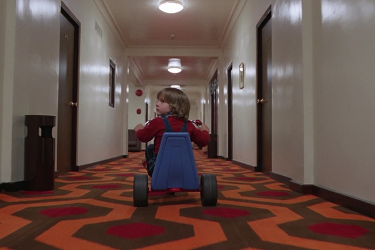
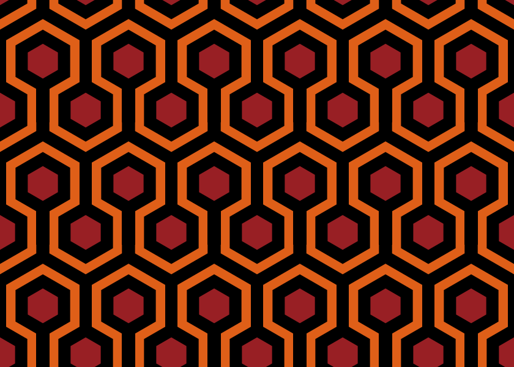

```{r, include = FALSE}
knitr::opts_chunk$set(
  collapse = TRUE,
  comment = "  "
)
```

```{r setup}
library(minisvg)
```


The Carpet in the Overlook Hotel from The Shining
==============================================================================

The carpet in the Overlook Hotel features prominently in the movie [The Shining](https://en.wikipedia.org/wiki/The_Shining_(film)).





The carpet itself has articles written about it:

* https://filmandfurniture.com/2015/09/the-power-of-pattern-the-carpet-in-the-shining-a-chat-with-patternity/
* https://filmandfurniture.com/2017/11/kubricks-carpet-in-the-shining/


```{r}
#~~~~~~~~~~~~~~~~~~~~~~~~~~~~~~~~~~~~~~~~~~~~~~~~~~~~~~~~~~~~~~~~~~~~~~~~~~~~~~
# carpet colours
#~~~~~~~~~~~~~~~~~~~~~~~~~~~~~~~~~~~~~~~~~~~~~~~~~~~~~~~~~~~~~~~~~~~~~~~~~~~~~~
red    <- rgb(152, 31, 36, maxColorValue = 255)
orange <- rgb(223, 95, 24, maxColorValue = 255)

#~~~~~~~~~~~~~~~~~~~~~~~~~~~~~~~~~~~~~~~~~~~~~~~~~~~~~~~~~~~~~~~~~~~~~~~~~~~~~~
# Function to calculate points around a hexagon
# @param cx,cy centre of hexagon
# @param r radius of hexagon
#~~~~~~~~~~~~~~~~~~~~~~~~~~~~~~~~~~~~~~~~~~~~~~~~~~~~~~~~~~~~~~~~~~~~~~~~~~~~~~
create_hex_points <- function(cx, cy, r) {
  angles <- pi/180 * seq(0, 360, 60)
  list(
    xs = round(cx + r * sin(angles), 2),
    ys = round(cy + r * cos(angles), 2)
  )
}


#~~~~~~~~~~~~~~~~~~~~~~~~~~~~~~~~~~~~~~~~~~~~~~~~~~~~~~~~~~~~~~~~~~~~~~~~~~~~~~
# Define the patterns fundamental sizes
#~~~~~~~~~~~~~~~~~~~~~~~~~~~~~~~~~~~~~~~~~~~~~~~~~~~~~~~~~~~~~~~~~~~~~~~~~~~~~~
sw <- 20      # stroke width
h  <- sw*10   # height
w  <- sw*7    # wiedth


#~~~~~~~~~~~~~~~~~~~~~~~~~~~~~~~~~~~~~~~~~~~~~~~~~~~~~~~~~~~~~~~~~~~~~~~~~~~~~
# Initialise SVG document
#~~~~~~~~~~~~~~~~~~~~~~~~~~~~~~~~~~~~~~~~~~~~~~~~~~~~~~~~~~~~~~~~~~~~~~~~~~~~~
doc <- svg_doc(width = 6*w, height = 3*h)
doc$rect(x=0, y=0, width="100%", height ="100%", fill =orange)


#~~~~~~~~~~~~~~~~~~~~~~~~~~~~~~~~~~~~~~~~~~~~~~~~~~~~~~~~~~~~~~~~~~~~~~~~~~~~~
# Initialise the pattern
#~~~~~~~~~~~~~~~~~~~~~~~~~~~~~~~~~~~~~~~~~~~~~~~~~~~~~~~~~~~~~~~~~~~~~~~~~~~~~
pat  <- doc$defs()$pattern(id = 'motif', width=w, height=h, patternUnits = 'userSpaceOnUse')
patg <- pat$g(stroke_width = sw, stroke='black')

#~~~~~~~~~~~~~~~~~~~~~~~~~~~~~~~~~~~~~~~~~~~~~~~~~~~~~~~~~~~~~~~~~~~~~~~~~~~~~
# Centre spot
#~~~~~~~~~~~~~~~~~~~~~~~~~~~~~~~~~~~~~~~~~~~~~~~~~~~~~~~~~~~~~~~~~~~~~~~~~~~~~
hex <- create_hex_points(w/2, h/2, sw*2)
patg$polygon(xs=hex$xs, ys=hex$ys, fill=red)

#~~~~~~~~~~~~~~~~~~~~~~~~~~~~~~~~~~~~~~~~~~~~~~~~~~~~~~~~~~~~~~~~~~~~~~~~~~~~~
# Lower red hexes
#~~~~~~~~~~~~~~~~~~~~~~~~~~~~~~~~~~~~~~~~~~~~~~~~~~~~~~~~~~~~~~~~~~~~~~~~~~~~~
hex <- create_hex_points(0, h-sw, sw*2); patg$polygon(xs=hex$xs, ys=hex$ys, fill=red)
hex <- create_hex_points(w, h-sw, sw*2); patg$polygon(xs=hex$xs, ys=hex$ys, fill=red)

#~~~~~~~~~~~~~~~~~~~~~~~~~~~~~~~~~~~~~~~~~~~~~~~~~~~~~~~~~~~~~~~~~~~~~~~~~~~~~
# upper red hexes
#~~~~~~~~~~~~~~~~~~~~~~~~~~~~~~~~~~~~~~~~~~~~~~~~~~~~~~~~~~~~~~~~~~~~~~~~~~~~~
hex <- create_hex_points(0, -sw, sw*2); patg$polygon(xs=hex$xs, ys=hex$ys, fill=red)
hex <- create_hex_points(w, -sw, sw*2); patg$polygon(xs=hex$xs, ys=hex$ys, fill=red)

#~~~~~~~~~~~~~~~~~~~~~~~~~~~~~~~~~~~~~~~~~~~~~~~~~~~~~~~~~~~~~~~~~~~~~~~~~~~~~
# Some of the black outline
#~~~~~~~~~~~~~~~~~~~~~~~~~~~~~~~~~~~~~~~~~~~~~~~~~~~~~~~~~~~~~~~~~~~~~~~~~~~~~
hex <- create_hex_points(0, -sw, sw*4); patg$polygon(xs=hex$xs, ys=hex$ys, fill='none')
hex <- create_hex_points(w, -sw, sw*4); patg$polygon(xs=hex$xs, ys=hex$ys, fill='none')

#~~~~~~~~~~~~~~~~~~~~~~~~~~~~~~~~~~~~~~~~~~~~~~~~~~~~~~~~~~~~~~~~~~~~~~~~~~~~~
# The black descenders
#~~~~~~~~~~~~~~~~~~~~~~~~~~~~~~~~~~~~~~~~~~~~~~~~~~~~~~~~~~~~~~~~~~~~~~~~~~~~~
patg$line(x1 = w/2, y1 = h-sw*3, x2=w/2, y2 = h, stroke_width=sw+2)
patg$line(x1 =   0, y1 = h-sw*7, x2=0  , y2 = h-sw*3)
patg$line(x1 =   w, y1 = h-sw*7, x2=w  , y2 = h-sw*3)

#~~~~~~~~~~~~~~~~~~~~~~~~~~~~~~~~~~~~~~~~~~~~~~~~~~~~~~~~~~~~~~~~~~~~~~~~~~~~~
# Use the pattern to fill a rectangle taking up the entire document
#~~~~~~~~~~~~~~~~~~~~~~~~~~~~~~~~~~~~~~~~~~~~~~~~~~~~~~~~~~~~~~~~~~~~~~~~~~~~~
doc$rect(x=0, y=0, width="100%", height="100%", fill=pat)
```


<details closed>
<summary> Show SVG text (click to open) </summary>
```{r echo=FALSE}
print(doc)
```
</details> <br />

```{r echo = FALSE}
if (interactive()) {
  doc$show()
} else {
  doc
}
```


## Animating the pattern

In order to animate the pattern, an `animateTransform` is applied to the 
`patternTransform` attribute.

```{r}
pat$animateTransform(
  attributeName = 'patternTransform',
  type          = 'translate',
  from          = '0 0',
  to            = paste(0, h),
  dur           = 5,
  repeatCount   = 'indefinite'
)
```

<details closed>
<summary> Show SVG text (click to open) </summary>
```{r echo=FALSE}
print(doc)
```
</details> <br />

```{r echo = FALSE, eval=FALSE}
if (interactive()) {
  doc$show()
  doc$save(here::here("vignettes", "svg", "carpet-01.svg"))
} 
```





