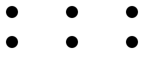

```{r, include = FALSE}
knitr::opts_chunk$set(
  collapse = TRUE,
  comment = "#>"
)
```

```{r setup}
library(minisvg)
```


## `SVGPattern` class 

One of my main uses for `minisvg` will be for pattern creation for use in plotting,
so there is a specific `SVGPattern` class for manipulating and displaying them.

Key differences from `SVGElement` class:

* `SVGPattern$as_full_svg()` embeds the pattern within a template of a full SVG
  document and applies the pattern to a rectangle which covers the entire page.
* `SVGPattern$save_full_svg()` saves the output of `as_full_svg()`
* Lets the user define `SVGPattern$filter_dev` as a filter that is applied to 
  the pattern.

```{r}
pat <- SVGPattern$new(
  id           = "test1", 
  width        = 100, 
  height       = 50,
  patternUnits = 'userSpaceOnUse'
)

pat$circle(cx = 20, cy = 20, r = 10)

# pat$show()
pat$save_full_svg("svg/README-svgpattern.svg", width=250, height = 100)
```


```{r echo=FALSE, results='asis'}
cat(
  "<pre>",
  "<details open><summary style='color: #4169E1;'> Show/hide SVG text </summary>",
  htmltools::htmlEscape(as.character(pat)),
  "</details>",
  "</pre>", sep='')
```





## Example Adding a filter to an `SVGPattern` class 

```{r}
#~~~~~~~~~~~~~~~~~~~~~~~~~~~~~~~~~~~~~~~~~~~~~~~~~~~~~~~~~~~~~~~~~~~~~~~~~~~~~
# Define a filter that uses turbulence to drive displacement
#~~~~~~~~~~~~~~~~~~~~~~~~~~~~~~~~~~~~~~~~~~~~~~~~~~~~~~~~~~~~~~~~~~~~~~~~~~~~~
displacement_filter <- stag$filter(
  id = "test-dispfilter",
  x = "-30%", y = "-30%", width="160%", height="160%",
  stag$feTurbulence(
    type          = "turbulence",
    baseFrequency = 0.05,
    numOctaves    = 4,
    seed          = 1,
    result        = "turbulence-image"),
  stag$feDisplacementMap(
    in_              = "SourceGraphic",
    in2              = "turbulence-image",
    scale            = 20,
    yChannelSelector = 'G'
  )
)

#~~~~~~~~~~~~~~~~~~~~~~~~~~~~~~~~~~~~~~~~~~~~~~~~~~~~~~~~~~~~~~~~~~~~~~~~~~~~~
# Add the filter to the pattern
#~~~~~~~~~~~~~~~~~~~~~~~~~~~~~~~~~~~~~~~~~~~~~~~~~~~~~~~~~~~~~~~~~~~~~~~~~~~~~
pat$filter_def <- displacement_filter

# pat$show()
pat$save_full_svg("svg/README-svgpattern-filter.svg", width=250, height = 100)
```


```{r echo=FALSE, results='asis'}
cat(
  "<pre>",
  "<details open><summary style='color: #4169E1;'> Show/hide SVG text </summary>",
  htmltools::htmlEscape(as.character(pat)),
  "</details>",
  "</pre>", sep='')
```


