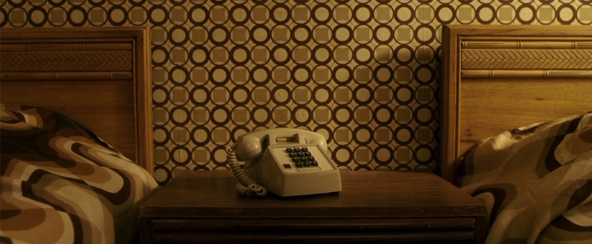
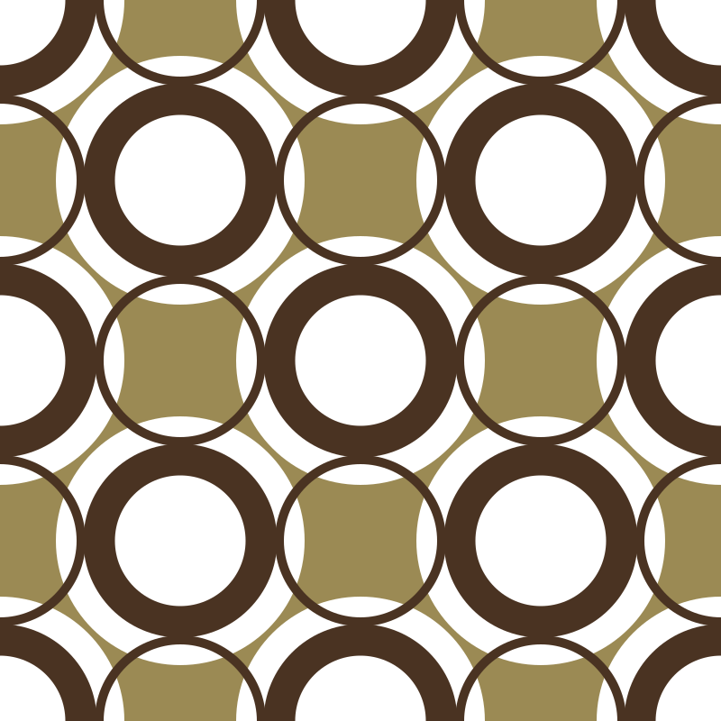

```{r, include = FALSE}
knitr::opts_chunk$set(
  collapse = TRUE,
  comment = "  "
)
```

```{r setup}
library(minisvg)
```


The Wallpaper from 'Lucky Number Slevin'
==============================================================================

This is some wallpaper from the movie [Lucky Number Slevin](https://en.wikipedia.org/wiki/Lucky_Number_Slevin)





## 70s wallpaper is my jam!

This example demonstrates:

* Using `svg_doc()` as an alternative to `SVGDocument$new()`
* Creating a `<defs><pattern>` object and applying it to a rectangle

```{r}
doc <- svg_doc(width = 800, height = 800) 
doc$rect(x=0, y=0, width="100%", height="100%", fill='#9B8A54')

pat  <- stag$defs()$pattern(id = 'motif', width=400, height=400, patternUnits = 'userSpaceOnUse')
patg <- pat$g()

patg$circle(cx=  0, cy=  0, r=138, fill= 'white')
patg$circle(cx=  0, cy=400, r=138, fill= 'white')
patg$circle(cx=400, cy=  0, r=138, fill= 'white')
patg$circle(cx=400, cy=400, r=138, fill= 'white')
patg$circle(cx=200, cy=200, r=138, fill= 'white')

patg$circle(cx=  0, cy=  0, r=90, fill= 'none', stroke = '#4a3322', stroke_width=35)
patg$circle(cx=  0, cy=400, r=90, fill= 'none', stroke = '#4a3322', stroke_width=35)
patg$circle(cx=400, cy=  0, r=90, fill= 'none', stroke = '#4a3322', stroke_width=35)
patg$circle(cx=400, cy=400, r=90, fill= 'none', stroke = '#4a3322', stroke_width=35)
patg$circle(cx=200, cy=200, r=90, fill= 'none', stroke = '#4a3322', stroke_width=35)

patg$circle(cx=200, cy=  0, r=90, fill= 'none', stroke = '#4a3322', stroke_width=10)
patg$circle(cx=  0, cy=200, r=90, fill= 'none', stroke = '#4a3322', stroke_width=10)
patg$circle(cx=400, cy=200, r=90, fill= 'none', stroke = '#4a3322', stroke_width=10)
patg$circle(cx=200, cy=400, r=90, fill= 'none', stroke = '#4a3322', stroke_width=10)

doc$append(pat)

doc$rect(x=0, y=0, width="100%", height="100%", fill=pat) 
```


<details closed>
<summary> Show SVG text (click to open) </summary>
```{r echo=FALSE}
print(doc)
```
</details> <br />

```{r echo = FALSE}
if (interactive()) {
  doc$show()
} else {
  doc
}
```


## Animating the pattern

In order to animate the pattern, an `animateTransform` is applied to the 
`patternTransform` attribute.

```{r}
pat$animateTransform(
  attributeName = 'patternTransform',
  type          = 'translate',
  from          = '0 0',
  to            = "400 0",
  dur           = 5,
  repeatCount   = 'indefinite'
)
```


<details closed>
<summary> Show SVG text (click to open) </summary>
```{r echo=FALSE}
print(doc)
```
</details> <br />

```{r echo = FALSE, eval=FALSE}
if (interactive()) {
  doc$show()
  doc$save(here::here("vignettes", "svg", "wallpaper-01.svg"))
} 
```





